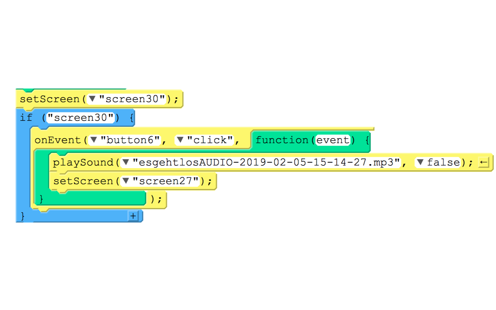
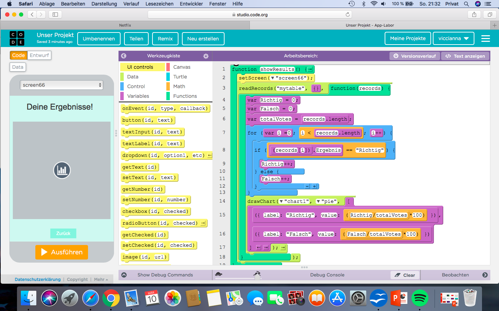
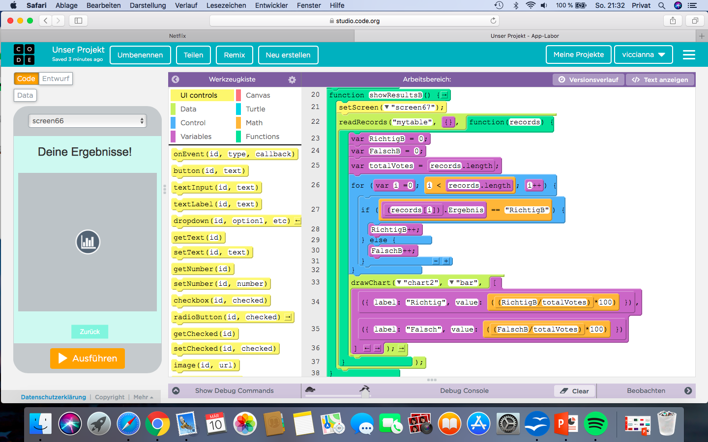
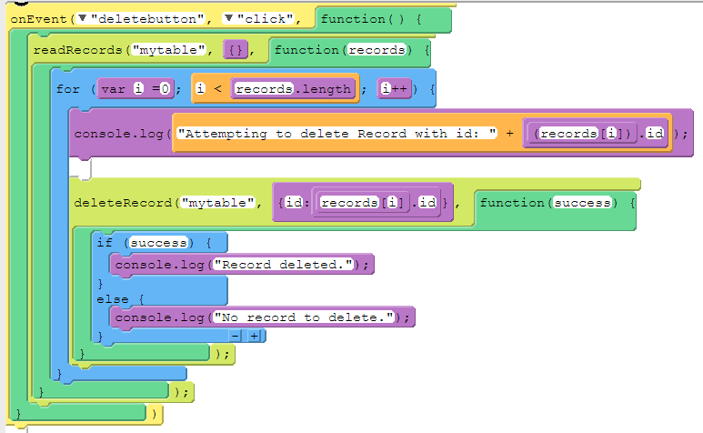
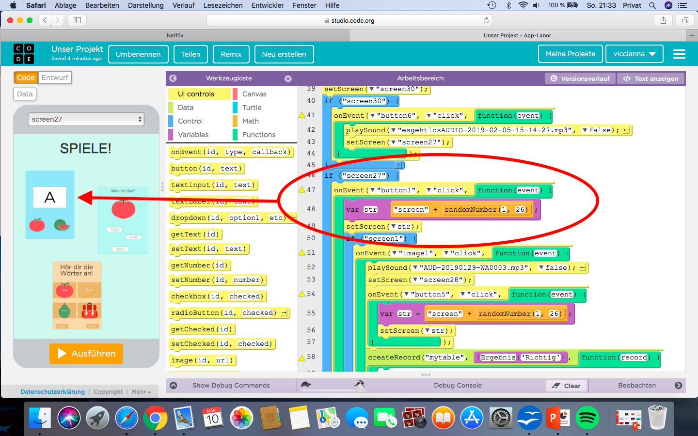
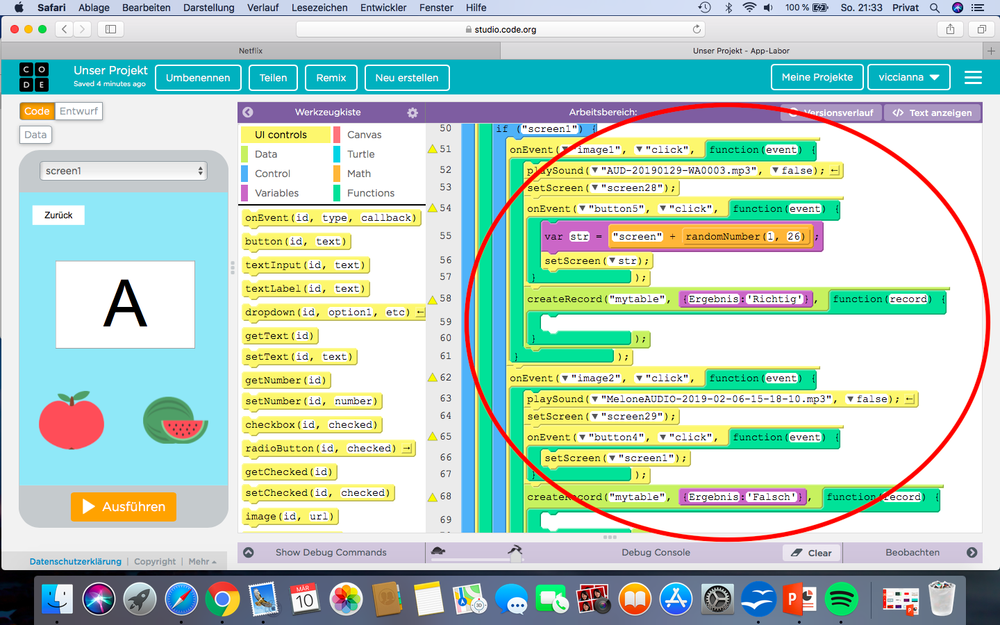

# Blog über das Spiel ("*Das ABC macht Spaß!*")

Ein Blog über unser programmieretes Spiel auf App-Labor.

    ![bsp stride]setScreen("screen30");
      if ("screen30") {
       onEvent("button6", "click", function(event) {
         playSound("esgehtlosAUDIO-2019-02-05-15-14-27.mp3", false);
         setScreen("screen27");
          });
      }

# Inhalt

[1. Einleitung und Idee](#1)

[2. Das Spiel](#2)

[3. Schlusswort](#3)

##  Einleitung und Idee

Hallo und herzlich Willkommen auf diesem Blog.
In diesem Projektblog werden wir beschreiben, was für ein Spiel wir programmiert haben, was unsere Intention war und schlussendlich wie es funktioniert beziehungsweise wie man es nachmachen kann. 

Unser erstes Projekt haben wir mit dem Programm „Snap!“ programmiert. Wir waren gut in das Programm eingearbeitet, deshalb wollten wir etwas Neues ausprobieren. Außerdem fanden wir die Idee ansprechend, eine App zu erstellen, die man auf das Handy runterladen kann.
Zur Auswahl standen dann die Programme „Appinventor“ und „AppLab“ zwischen denen wir überlegt haben. Um uns zu entscheiden haben wir mit beiden Programmen ein paar Sachen ausprobiert und uns dann schließlich für „AppLab“ entschieden. Bei letzterem hat uns das Design und die Aufmachung einfach besser gefallen, außerdem war es mit mehr Betriebssystemen für das Handy kompatibel.

Uns war klar, dass wir ein Projekt machen wollten, was einen tieferen Sinn hat und Leuten wirklich nützen und  helfen kann. Unsere ersten Ideen waren Vokabeltrainer für Sprachen oder Naturwissenschaften zu erstellen. Allerdings war uns diese Idee dann doch zu langweilig, da es derartige Apps bereits in großer Zahl gibt und alle das selbe Ziel verfolgen. 
Der nächste Einfall, den wir dann hatten, hat uns dafür umso besser gefallen. Wir haben überlegt, eine Alphabet und Wörter Lernapp für Kinder zu erstellen!
Auf diese Idee sind wir auch dadurch gekommen, dass wir beide jüngere Geschwister haben und mit diesen auch ab und zu die Buchstaben und Wörter durch Bilder in Bilderbüchern gelernt haben.

Wichtig war uns bei der Entwicklung des Spiels nicht nur der praktische Nutzen, sondern auch die Ästhetik. Wir wollten schließlich, dass die Kinder Spaß beim spielen haben und sich beim anschauen der Bildschirme freuen. 
Darauf haben wir auch bei unserer Farbauswahl geachtet. Jeder Bildschirm ist in einer pastelligen Variante einer bunten Farbe gehalten, damit es schön aussieht aber die Spieler gleichzeitig nicht von einem sehr knalligen Hintergrund abgelenkt sind.
Bei den Symbolen, die wir zu den einzelnen Wörtern ausgewählt haben, war uns auch wichtig, dass es Dinge sind die Kinder kennen und gerne mögen. Beispielsweise Tiere, Essen oder das Wetter. 
Damit die Buchstaben und Wörter besser verinnerlicht werden, wollten wir auf jeden Fall auch noch Töne einfügen. Am authentischsten fanden wir es, wenn diese nicht von uns, sondern ebenfalls von einem Kind gesprochen werden. Deshalb haben wir einen Bruder gefragt, ob er  die Sätze einsprechen kann. Gegen ein Eis hat er sich bereit erklärt. 
Zuletzt ist es auch entscheidend für uns gewesen, dass die Spieler motiviert werden. Deshalb haben wir Töne wie „Applaus, Applaus“, „Weiter so!“ oder „Schade, beim nächsten Mal“ aufgenommen und eingefügt, damit die Kinder angefeuert werden weiter zu spielen und die Buchstaben zu lernen. 

Am Ende hat dann nur noch ein Name gefehlt. Schließlich haben wir uns für  „Das ABC macht Spaß!“  entschieden, da dieser Name unsere Intention vermittelt, etwas zu programmieren, das nützlich ist und gleichzeitig Spaß macht. Wir hoffen, dass es uns gelungen ist und wünschen euch ebenfalls viel Spaß beim Lesen unseres Projektblogs! Vielleicht habt ihr danach ja auch Lust euch wieder ein bisschen wie ein Kind zu fühlen und noch einmal das bunte ABC mit unserer App zu lernen ;)

##  Das Spiel

Das Spiel beginnt jetzt mit einer „if“ Funktion. Wenn man sich also auf dem „screen30“ befindet und den „button6“ klickt, wird der Sound „es geht los“ gespielt und der „screen27“ aufgerufen. Der Button 6 ist der „Los“ Knopf auf dem Startbildschirm. 
Der Bildschirm 27, auf den man dann weitergeleitet wird, ist der Übersichtsbildschirm auf dem man sich für eins der drei Spiele entscheiden kann. Wenn man das erste Spiel spielen möchte, muss man auf den „button1“ klicken. 
Mit der Variable, die wir dann eingefügt haben, definieren wir, dass „str“ ein  zufälliger Bildschirm zwischen 1 und 26 ist. Indem wir danach „setScreen str“ eingefügt haben wird jetzt ein einer dieser Screens zufällig aufgerufen. 
Das ist wichtig für unser Spiel, da wir keine feste Reihenfolge der Buchstaben haben wollten, damit das Spiel nicht vorhersehbar wird. 

Für jede der 26 Buchstaben des Alphabets haben wir einen Screen mit zwei Symbolen erstellt. Eins der Symbole fängt mit dem Buchstaben an, der auf dem Bildschirm gezeigt wird und ein Symbol nicht. Das heißt die Spieler müssen sich entscheiden, welches Symbol richtig ist und auf das müssen sie dann drauf klicken. 
Da es immer unterschiedlich, ob das richtige Symbol das erste oder das zweite ist, haben wir bei jedem „image“ programmiert, als was es gewertet werden soll.
Bei „screen1“, auf dem das A abgebildet ist, ist das „image1“ also der Apfel das richtige Bild und das „image2“ also die Melonen sind das falsche Symbol. 
Wenn jetzt also „image1“ angeklickt wird, haben wir durch „playSound“ eingefügt, dass das Spiel den Satz „A wie Apfel“ spielt. Gleichzeitig wechselt das Bild auf den „Screen28“, auf dem ein GIF von einer Erde und einem Mond ist, die sich ein High Five geben. Das ist also unser Bildschirm, wenn man alles richtig gemacht hat. 
Auf diesem Sieger Bildschirm ist unten eine Button, der „button5“. Wenn man auf diesen Knopf klickt, gelangt man wieder auf einen Bildschirm mit einer zufälligen beziehungsweise „random“ Nummer zwischen 1 und 26, kann das Spiel also weiterspielen.

Gleichzeitig wird ein Eintrag in unsere Statistik generiert, dafür dass das richtige angeklickt wurde. Das haben wir mit der Funktion „createRecord“ generiert. Das Diagramm haben wir dann „mytable“ genannt und das Ergebnis was durch das klicken auf das richtige Bild gespeichert wird heißt „Richtig“.
Mit dem „console.log“ definieren wir das Ergebnis noch mal und geben ihm eine ID, die dann zusammen mit dem Ergebnis „Richtig“ gespeichert wird.

Wenn man allerdings auf das zweite und hier falsche Bild der Melonen klickt, also immer noch in der „if screen1“ Funktion auf „image2“ klickt, wird erst einmal der „sound“ „M wie Melone“ gespielt. Dann gelangt man auf den „screen29“. Auf diesem Bildschirm ist auch ein GIF, diesmal allerdings von einer traurigen Erde und einem traurig guckenden Mond. 
Wenn man auf diesem Bildschirm auf „button4“ „clicked“ gelangt man wieder auf den Screen, auf dem man auf dem man den falschen Buchstaben ausgewählt hat. Hier also wieder auf den „screen1“ mit dem Buchstaben A, dem Apfel und den Melonen. Das haben wir so gemacht, damit die Kinder ihren Fehler merken und gucken können, was richtig gewesen wäre. 
Auch für das Anklicken des falschen Bildes wird jetzt ein Eintrag mit „Ergebnis Falsch“ in „mytable“ gespeichert und eine ID für dieses Ereignis erstellt. 

Wenn die Spieler dieses Spiel nicht mehr weiter spielen möchten, können sie auf den „zurück“ Knopf klicken, der hier der „button13“ ist. 
Sobald sie das gemacht haben, werden sie zum Bildschirm 66 weitergeleitet, auf dem die Statistik mit den Ergebnissen von „Falsch“ und „Richtig“ ist.
Das haben wir programmiert indem wir bei „if screen1“ geschrieben haben, dass die Funktion „showResults“ eintritt, wenn auf den „button13“ geklickt wird. Die Funktion „showResults“ haben wir ganz am Anfang des Spiels einmal definiert. 

Die Funktion „showResults“ bewirkt erst einmal, dass der Bildschirm 66 aufgerufen wird. Auf diesem haben wir die Statistik 1 eingefügt, welche von Spiel 1 die Daten sammelt, wie oft das Falsche („Ergbnis Falsch“) und das Richtige („Ergebnis Richtig“) angeklickt wurden. Jedes Mal, wenn etwas falsches oder richtiges angeklickt wurde, bekommt dieses Einzelereignis eine ID, die dann von AppLap gespeichert wird. 
Die Statistik die entsteht heißt „mytable“ und um sie zu erstellen mussten wir erst einmal ein paar Variablen definieren. 
Die Ergebnisse „Richtig“ und „Falsch“ bekommen beide die Nummer „0“. Das ist wichtig, damit die Ergebnisse überhaupt eine Größe haben. 
Die gesamten Ergebnisse (definiert als „totalVotes“) ergeben zusammen die gesamte Größe der Statistik („totalVotes“ → „records.length“). 
Wenn nun das Ergebnis ( „var i „) 0, also entweder „Falsch“ oder „Richtig“ ist, wird das zu der Statistik hinzugefügt. Wenn die Antwort also „Richtig“ ist, wird das auch mit dem Wort „Richtig“ in der Statistik gespeichert, wenn die Antwort nicht richtig ist, wird es mit dem Wort „Falsch“ gespeichert. 

Aus diesen Daten wird dann mithilfe von „drawChart“ und „pie“ eine PieChart oder auf Deutsch ein Kuchendiagramm erstellt, welches die relative Anzahl der falschen und der richtigen Antworten in Prozent anzeigt. Das haben wir dadurch erreicht, dass wir beiden Möglichkeiten die Wertigkeit („value“) Eins gegeben haben und diese dann durch die gesamte Menge der Ergebnisse geteilt und Mal hundert genommen wird. 

So kann sich nun jeder Spieler anschauen, wie oft er falsch und wie oft er richtig lag. 

Von diesem Bildschirm kann man jetzt über den zurück Knopf („button75“) wieder auf den Bildschirm 27 gelangen, auf dem man wieder die Auswahl zwischen den drei Spielen hat. 

Der selbe Mechanismus funktioniert bei den restlichen Buchstaben des ersten Spiels, es ist nur immer unterschiedlich, ob das erste oder das zweite Bild das richtige ist. Außerdem sind natürlich alle Nummern der „screens“ und der „buttons“, sowie der „images“ unterschiedlich. 

Möchte man allerdings die Ergebnisse löschen beziehungsweise zurücksetzen, kann man auf den „Löschen“ Knopf klicken. Das ist der „deletebutton“ und was dann passiert haben wir mit dem Event „deletebutton clicked“ programmiert. Dieser Button löscht die Ergebnisse von „mytable“ . 
Zuerst einmal haben wir auch für diese Aktion ein console.log also sozusagen eine ID erstellt, die wir „Attemting to delete Record with id: „ genannt haben. 
Danach folgt das eigentliche Löschen, was durch die Funktion „deleteRecord“ „mytable“passiert. Diese hat die ID der Ergebnisse der Statistik. Wenn das löschen erfolgreich war, beziehungsweise Ergebnisse zum löschen da sind, wird das durch die Funktion „success“ ausgedrückt und die ID „Record deleted“ wird erstellt. Wenn es nicht erfolgreich war, oder keine Ergebnisse zum löschen da waren wird die ID „No record to delete“ erstellt. 
So lassen sich die Vorgänge auch besser nachvollziehen.

Bei unserem zweiten Spiel geht es darum, dass die Spieler die richtige Schreibweise von vielen Wörtern lernen sollen. Dafür ist immer ein Symbol auf dem Bildschirm und drei Möglichkeiten, wie das Wort geschrieben werden könnte. 
Auf das Spiel gelangt man, indem man auf dem Auswahlbildschirm („screen27“) auf den „button2“ klickt. Ähnlich wie beim ersten Spiel wird jetzt wieder ein zufälliger Bildschirm aufgerufen. Diesmal allerdings von den screens 31 bis 58. 
Wie wir dann die Funktionen programmiert haben, werden wir beispielhaft an Screen 39 mit dem Bild von einem Igel erklären. 
Bei diesem Bildschirm sind die Antwortmöglichkeiten 1 und 3 („legel“ und „Ikel“) falsch und die Antwortmöglichkeit 2 („Igel“) ist richtig. 
Wenn man jetzt also auf „text_input27“ („Ikel“) „clicked“, wird der Sound „nicht traurig sein“ gespielt. Alternativ haben wir noch andere Sounds bei falschen Antworten eingefügt. Beispielsweise „Schade, beim nächsten Mal“, „Ohh schade“ oder „Versuchs noch Mal“. 
Gleichzeitig wird der Bildschirm 29 aufgerufen, also wieder der Bildschirm mit der traurigen Erde und dem Mond. Wenn man auf diesem Bildschirm auf den „weiter“ Knopf („button4“) klickt, gelangt man wieder auf den Screen 39 mit dem Igel und kann es noch einmal versuchen. 
So läuft es auch ab, wenn man auf den „text_input25“ (also legel) klickt, nur dass ein anderer Ton gespielt wird.
Das Ergebnis wird wie beim ersten Spiel zu einer Statistik hinzu gefügt. Allerdings sind beide Statistiken unabhängig voneinander, dass heißt man kann sehen in welchem Spiel man besser ist und die Ergebnisse werden nicht zusammen angezeigt. 
Auch diese Statistik heißt „mytable“, allerdings wird das Ergebnis hier nicht als „Falsch“, sondern als „FalschB“ gespeichert, damit es nicht bei der ersten Statistik dazu gerechnet wird. 

Wenn man auf die richtige Antwortmöglichkeit, also „text_input26“ („Igel“) klickt, gelangt man wieder auf den Siegerbildschirm „screen28“ mit dem Mond und der Erde, die sich ein High Five geben. Diesmal wird der Sound „applaus, applaus“ gespielt. Alternativ haben wir noch die Töne „prima“, „weiter so“ und „gut gemacht“.
Wenn man jetzt auf den „Weiter“ Knopf „button5“ klickt, gelangt man wieder auf einen zufälligen Bildschirm des Spiels. 
Die richtige Antwort wird in der zweiten Statistik mit „RichtigB“ gespeichert. 
Von dem Bildschirm 39 gelangt man über den „Zurück“ Knopf („button84“) zur zweiten Statistik, indem die Funktion „showResultsB“ aufgerufen wird. 
Die Funktion „showResultsB“ ist ähnlich aufgebaut wie „showResults“, allerdings sind die Variablen, die gleich 0 gesetzt sind, diesmal „FalschB“ und „RichtigB“. Außerdem wird kein Kuchendiagramm erstellt, sondern ein Balkendiagramm. Das wollten wir machen, um mehr Abwechslung in das Spiel zu bringen und da jeder andere Präferenzen hat, welche Art einer Statistik er lieber mag.
Im Endeffekt heißen die Ergebnisse trotzdem „Richtig“ und „Falsch“ ohne B, indem wir diese label als den Wert definiert haben, der sich ergibt, wenn man die Ergebnisse „RichtigB“ und „FalschB“ durch die Gesamtzahl der Votes teilt und dann Mal hundert nimmt um die Zahlen als Prozent zu erhalten. 

Unser drittes Spiel ist dafür da, dass sich die Spieler noch mal alle Wörter zu den passenden Buchstaben anhören können. Zu diesem Spiel gelangt man, wenn man auf der Seite 27 auf den „button3“ klickt. Es wird nun ein zufälliger Bildschirm von 59 bis 65 aufgerufen. 
Auf den Bildschirmen sind dann jeweils 4 Symbole mit der richtigen Schreibweise. 
Beispielhaft werden wir das jetzt an dem „screen63“ zeigen. Dort sind eine Orange, eine Pizza, eine Qualle und Regen abgebildet. Wenn man jetzt beispielsweise auf den „button34“, also auf die Pizza klickt, wird der Sound „P wie Pizza“ gespielt. 
Um auf den nächsten Bildschirm zu gelangen, muss man auf „weiter“ („button38“) klicken und wird auf einen zufälligen Bildschirm des Spiels weitergeleitet. 
Wenn man ein anderes Spiel spielen möchte, muss man auf den „zurück“ Knopf („button37“) klicken und es wird wieder der Startbildschirm 27 aufgerufen, auf dem man dann die Wahl zwischen einem der drei Spiele hat.

##  Schlusswort

Jetzt wisst ihr, wie wir unsere App „Das ABC macht Spaß!“ programmiert haben. 
Auch oder gerade weil es immer wieder einige Rückschläge oder komplexe Probleme gab hat es uns schlussendlich doch sehr viel Spaß gemacht, da wir sehr glücklich mit unserer Idee und dem Ergebnis waren und das Programm ein schönes Design hatte. 
Uns hat auch gefallen, dass wir nicht wieder mit Snap! Gearbeitet, sondern etwas komplett neues ausprobiert haben. 
Besonders glücklich sind wir mit der Statistik, da unser Spiel so viel professioneller ist und es interessant ist zu sehen, wie oft etwas falsches oder richtiges angeklickt wurde. 
Zeitlich hätte es allerdings überhaupt nicht geklappt, wenn wir uns nicht oft Zuhause an das Spiel ran gesetzt hätten und versucht haben Probleme zu lösen oder etwas neues einzufügen. 
An dem Fakt, dass wir das Zuhause gemacht haben sieht man aber ganz gut, dass es uns wirklich Spaß gemacht hat und wir das Spiel weiter perfektionieren wollten.
Also können wir die Bilanz ziehen, dass wir Informatik wirklich genossen haben und es sehr schön ist, dass wir durch den Unterricht einen Einblick in etwas bekommen haben, mit dem wir uns vielleicht so nicht beschäftigt haben. 
Zusätzlich können wir uns vorstellen auch in Zukunft unabhängig von der Schule noch mal ein Informatikprojekt selbstständig anzufangen, da es sehr schön ist wenn man sich mit etwas auseinander setzt, Lösungen findet und schließlich ein fertiges und funktionierendes Ergebnis hat mit dem man sehr zufrieden ist.
Toll ist auch zu sehen, was wir in dem Jahr insgesamt für Fortschritte gemacht haben. Anfänglich hatten wir keine Ahnung, was wir uns unter Informatik vorstellen sollen und auch nach den ersten Stunden konnten wir uns nicht ausmalen einmal so ein Projekt zu erstellen, wie wir es jetzt haben. Der Unterricht war eine schöne Zeit und hat schließlich für uns sehr zufrieden stellende Ergebnisse geliefert. 

Wir haben die Hintergründe bzw. Screens als erstes erstellt. Dazu haben wir auf der Website oben links auf "Entwurf" geklickt. Daraufhin öffnete sich eine Spalte in der man verschiedene Optionen zum Gestalten des Screens auswählen kann wie zum Beispiel ein Textfeld hinzufügen oder die Farbe des Hintergrunds geändert werden kann. Zunächst haben wir dann 26 Screens erstellt und jeweils verucht eine andere Farbe zu erstellen. Danach wurde ein Textfeld eingefügt und die einzelnen Buchstaben in richter Größe hingeschrieben. Danach wirden zwei Felder für Bilder hinzugefügt. Als letztes haben wir noch einige Button hinzugefügt, das wird später noch genauer erklärt.

Unser Spiel beginnt mit einem "*function*"-Block an. Dieser heisßt "showResults" und bezieht sich auf unsere Statistik welche wir erst später bei den eigentlichen Spielen eingebaut haben. Also sobald später eine Funktion angeklickt wird, wird dieser Befehlblock ausgeführt. Dieser beginnt mit "*setScreen*" mit der *ID* "screen66", welcher links auf dem Bild zu sehen ist. Darauf folgt der Befehl "*readRecords*" mit der *ID* "mytable". And diese ist eine weitere Funktion angebunden (dunkelgrün) mit der *ID* "records". In lila sieht man ein paar Variabeln, welche wir erstellt und definiert haben. Die erste *var* ist "Richtig=0", die Zweite ist "Falsch=0" und die Nächste ist "totalVotes=Records.lenght" ...

....

-> Fehler anmerken: zu viele IDs, überfordert
unterfordert weilo hochbegabt
Die "*onEvent*" Funktion sagt, dass wenn man auf "deletebutton" klickt, dann wird eine Funktion ausgelöst.

Nachdem die vorherigen Befehlblöcke nun erklärt wurden, kommt jetzt der "richtige" Anfang des Spiels. Dieser beginnt mit dem schon definierten Befehl "*setScreen*" mit der *ID* "screen30". Damit wird automatisch dieser bestimmte Screen zu anfang des Spiels geöffnet. Als nächstes folgt ein "*if*"-Befehl. Dieser Befehl mit derselben *ID* wie eben beinhaltet mehrere Befehle angefangen mit "*onEvent*". In diesem Block steht "button6" als die *ID*, "click" als *type* und zum Schluss eine Funktion mit der Definition "event". Die "*onEvent*"Funktion beinhaltet zwei weitere Befehle und zwar "*playSound(ID)*, false" und "*setScreen(screen27)*". Zusammengesetzt bedeutet diese ganze Klammer nun, wenn man auf "screen30" ist und dann den Button "button6" angklickt, dass wird ein bestimmter Sound abgespielt und es wird ein andere Screen geöffnet. (Buuton6 sieht man auf dem Bild mit der Beschriftung: LOS)

In rot eingekreist sieht man hier einmal die Weiterführung zum vorherigen Bild. Die Ausgangssituation war, dass man auf Screen27 landet. Sobald das geschieht, folgt wieder eine "*if*"-Schleife. Diese beinhaltet, eine "*onEvent*" Funktion. Da das eingekreiste erst einmal nur für die Auswahl der Spiele gilt, hat der Spieler ja eine gewisse Wahl. In diesem Fall, wenn er auf den Button "button1" klickt, wählt er das 1. Spiel, welches wir gleicfh näher erläutern. Diese Funktion enthält einen neue Variable, die so definiert ist, dass ihr *ID* gleich "str" ist und sich aus der *ID* "screen" * eine "randomNumber(1,26)" zusammensetzt. Das bedeutet, es wird aus den ganzen Screen, welche von "screen1" bis "screen26" gehen, ein Zufälliger ausgewählt. Danach wird der folgende Befehl diesen zufällig Ausgewählten öffnen. 

Daraufhin beginnt das erste Spiel: "ABC-lernen mit Bildern"

Hiermit beginnt das 1. Spiel. Das Ziel hierbei ist, dass man einen Buchstaben gegeben hat und man muss dazu das passende Bild anklicken, welches mit dem gezeigten Buchstaben als Wort anfängt. Ein Beispiel wäre: gegeben ist "A" und dann klickt man als Bild den Apfel an.

Das Prinzip der Befehlkette machen wir hier am einem Beispiel klar. 5r

Hier machen wir die Schleife wieder einem Beispiel deutlich. In der "*if*"-Schleife befinden sich drei "*onEvent*" Funktionen. 

