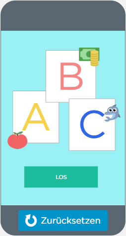

# Block über das Spiel ("*ABC lernen*")

Ein Blog über unser programmieretes Spiel auf App-Labor.

#Inhalt

[1. Einleitung und Idee](#1)

[2. Das Spiel](#2)

##  Einleitung und Idee

Hallo und herzlich Willkommen auf diesem Blog. Wie ihr wahrscheinlich schon von unserem Stundenblog wisst, werden wir euch hier alles rund um unser zweites Informatikprojekt erläutern und Schritt für Schritt erklären. Dazu haben wir zum Verständnis auch zusätzlich Bilder im Laufe der Erläuterung eingefügt.

Und nun viel Spaß beim Lesen!

Zunächst ist hier eine kleine Einleitung, welche erläutert wie wir auf die Idee unseres jetztigen Projekts gekommen sind:
Wie schon im Stundenblock erwähnt, hatten wir zu anfang nicht die leiseste Idee für ein neues Spiel. Doch wir waren uns ziemlich schnell einig, dass wir diesesmal ein neues Programm für unser Projekt nutzen wollen. Dies aus dem einfachen Grund, dass wir etwas anderes ausprobieren wollen. Da wir mit Snap! doch ziemlich lange gearbeitet hatten und einigermaßen gut eingearbeitet waren, wollten wir uns auf neues Terrain begeben. Außerdem haben wir für uns beschlossen, dass wir ein Handyspiel programmieren wollten und dies ist mit Snap! nicht wirklich möglich. Unsere engere Auswahl beinhaltete dann Applab und Appinventor. Schließlich haben wir uns dann für Applab entschieden, da wir dieses Programm umgänglicher fanden (insbesondere was das Design anging). 
Unsere ersten Ideen waren: Vokabeltrainer (für Englisch und Fachbegriffe z.B in Biologie) und eine Quizapp für Biologie. Da wir aber bei beiden Ideen nicht sicher bei der Umsetzung waren haben wir nachwievor über andere Spielideen nachgedacht. Aber wir hatten bei allen Ideen die Intention, etwas mit Lerneffekt zu programmieren. Wie bei unserem ersten Spiel, haben uns teilweise unsere kleinen Geschwister inspiriert. Daraufhin kam uns die Idee ein Spiel zu programmieren, welches Kleinkindern das Alphabet beibringt. Indem die Kinder den Buchstaben groß auf dem Bildschirm sehen, müssen sie eins von zwei Bildern anklicken. Das richtige Bild fängt mit dem dazugehörigen Buchstaben zusammen. Um den Lerneffekt noch weiter zu vergrößern, wird auch bei jedem Anklicken eines Bildes (egal ob richtig oder falsch) der Gegenstand ausgesprochen, sodass die Kinder auch lernen, wie die Bilder ausgesprochen werden (z.B. "A, wie Apfel" oder "B, wie Banane").

##  Das Spiel

 

Der Einstieg in unser Spiel ist auf dem Screenshot hier rot eingekreist. Das Spiel beginnt mit unserem Startbildschirm, welcher auf dem Screenshot (links) zu sehen ist. Der Befehl "*set screen(screenId)*" ganz am anfang bewerkstelligt, dass ein bestimmter Screen auftaucht sobald man auf "*Ausführen*" (links auf dem Bildschirm) klickt. In unserem Fall ist die ScreenId "*screen30*" und demnach haben wir dies in das Kästchen eingegeben.
Der nächste Befehl ist ein "*if()*"-Befehl. Wie auch die deutsche Übersetzung sagt, ist dieser Befehl eine bedingung, die wir definiert haben. In die leere Klammer haben wir in diesem Fall erneut "*screen30*" eingesetzt. Dies ist damit zu begründen, dass es sich bis hierher immernoch um den gleichen Screen handelt. Unter "*if()*" haben wir mit weiteren Befehlen einen Block erstellt, welcher das eigentliche Spiel einleitet.
Zunächst folgt der Befehl "*onEvent (id, type, callback)*" verbunden mit "*function()*". Die erste Lücke des ersten Befehls für "*id*" füllt "*button6*". In die zweite Lücke "*type*" ist "*click*" eingesetzt und die letzte Klammer besteht aus dem "*function()*"-Befehl. Dieser Block zusammengesetzt bewirkt, dass sobald man auf den Button (auf dem Screen unten in der Mitte) klickt, das Spiel "*Beginnt*". 
Zusammenhängend mit diesem Befehlblock folgt nach dem eben Erläuterten der Befehl "*var(str)="hello world"*". Hinter dem Gleichzeichen ist ein Operator ("*()+()*") eingefügt. In die erste Klammer ist "screen" hinzugefügt worden. In der zweiten steht "*randomNumber(1,26)*". Damit wird festgelegt, dass sobald das Spiel beginnt ein zufälliger Screen und damit zufällige Buchstaben auftauchen. Auf diesen Befehl folgt ein letzter, welcher diesen Block abschließt: "*setscreen(str)*". Damit wird dann endgültig der Screen gewechselt und die "*Id*" ist hier "*str*". Dies ist notwendig damit der Befehl weiß, dass er einen "*randomscreen*" aussucht.

 
